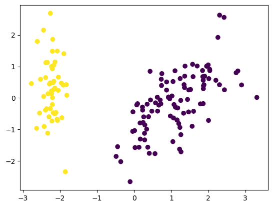

# 🌲 Hierarchical Clustering


An unsupervised machine learning project that applies **Hierarchical Clustering** to group data points based on similarity and visualize the resulting clusters.

---

## 📌 Project Overview

This project demonstrates **Hierarchical Clustering**, an unsupervised learning technique that builds clusters by iteratively merging or splitting data points based on distance metrics. The final clustering output visually shows how data points are grouped without specifying the number of clusters beforehand.

---

## 📁 Project Structure

- Hierarchical_clustering.ipynb — Main notebook implementing hierarchical clustering  
- hierarchical_output.png — Visualization of hierarchical clustering result  
- README.md — Project documentation  

---

## ⚙️ Technologies Used

- Python  
- NumPy  
- Pandas  
- Matplotlib  
- scikit-learn  
- SciPy  
- Jupyter Notebook  

---

## 🧠 Machine Learning Model

- Algorithm: Hierarchical Clustering  
- Learning Type: Unsupervised Learning  
- Linkage Method: Agglomerative  
- Distance Metric: Euclidean Distance  

---

## 📊 Clustering Output

The plot below shows the final clusters formed using hierarchical clustering.  
Data points with similar characteristics are grouped together based on distance relationships.

### Hierarchical Clustering Result


---

## ▶️ How to Run

1. Clone the repository  
```text
git clone https://github.com/btboilerplate/Hierarchical_Clustering.git  
```

2. Install required libraries  
```text
pip install numpy pandas matplotlib scikit-learn scipy  
```

3. Open Hierarchical_clustering.ipynb and run all cells sequentially  

---

## 🧪 Key Observations

- Clusters are formed without predefining the number of clusters  
- Hierarchical clustering captures nested cluster structures  
- Visualization clearly shows separation between groups  
- Useful for exploratory data analysis  

---

## 🚀 Future Improvements

- Add dendrogram visualization  
- Compare with K-Means and DBSCAN  
- Experiment with different linkage methods  
- Apply clustering on higher-dimensional datasets  

---
